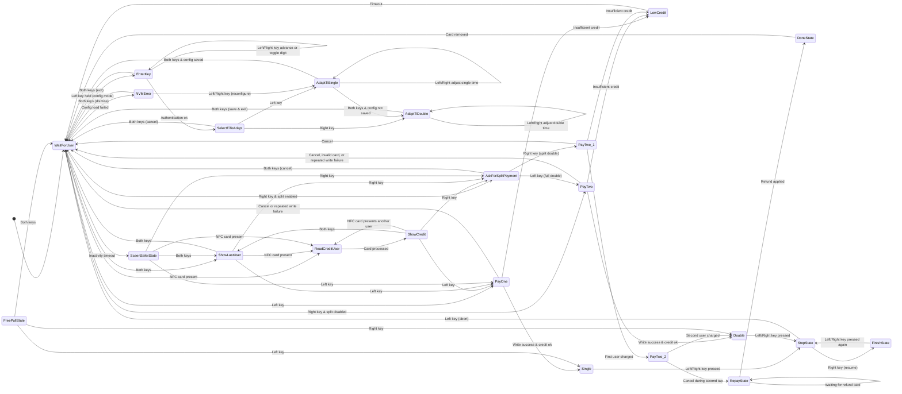

# Mill Controller State Machine

The controller logic in `src/Controller.cpp` is organized as a state machine that reacts to key inputs, NFC card events, configuration status, and timeouts. The diagram below summarizes the primary transitions between the states defined in `include/Controller_defines.h`.

## Notes

- `StateBegin(...)` resets timers and shared variables whenever a new state is entered, so transitions labeled “cancel” generally restore the controller to `WaitForUser` with a clean slate.
- Many display-oriented states (for example `LowCredit`, `ShowCredit`, `DoneState`, and `SceenSaferState`) rely on `TimeOut(...)` checks in `Controller::States` to fall back to `WaitForUser` after a delay, which is omitted from the diagram for readability except where it represents the primary exit path.
- Error handling in the payment states retries NFC writes several times before abandoning the operation and returning to `WaitForUser`.
